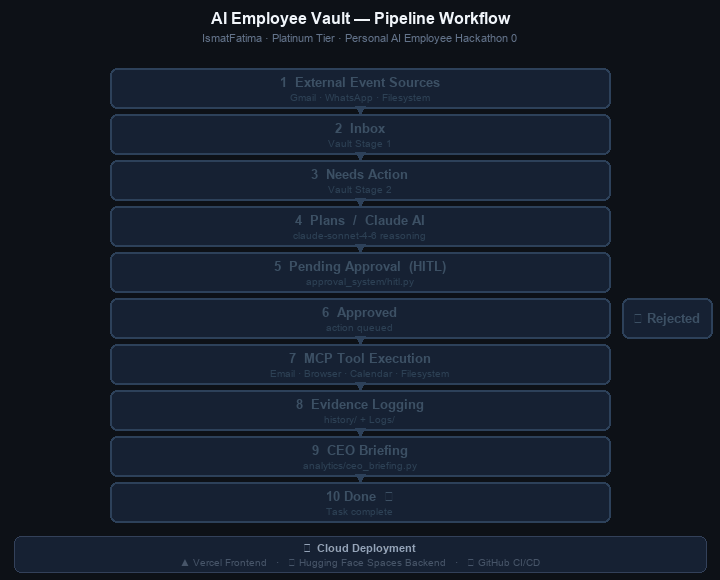
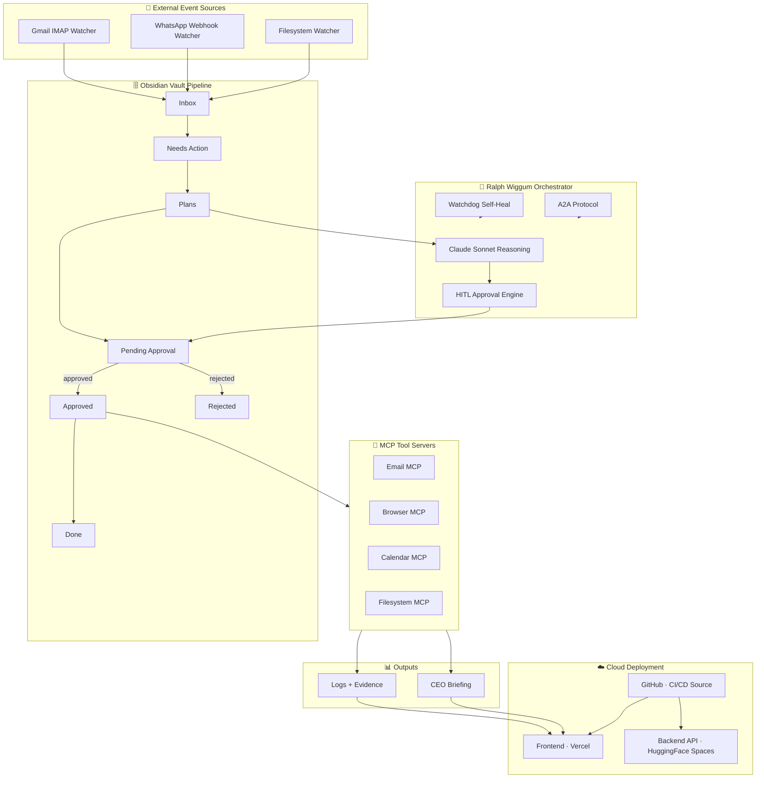
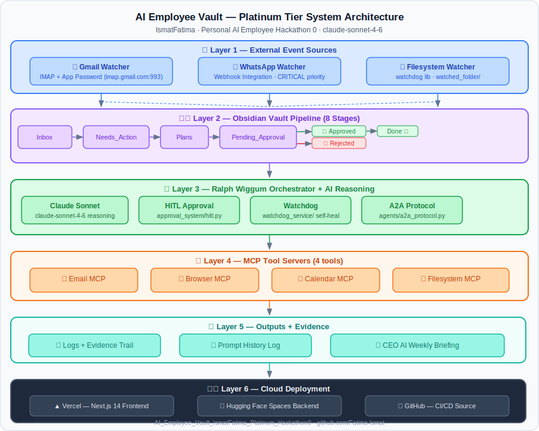

# 🏆 AI Employee Vault — IsmatFatima — Platinum Tier
### Personal AI Employee Hackathon 0

> **Project Owner:** Ismat Fatima &nbsp;|&nbsp; **Tier:** Platinum &nbsp;|&nbsp; **Model:** claude-sonnet-4-6


---

## 🎥 Demo Video

> Demo video will be added here after final recording.

- YouTube Demo: `COMING_SOON`
- Live system is already accessible at the Vercel link above

---

## 🎬 System Workflow Demo



This animation shows the full autonomous AI Employee pipeline — from watcher input through Claude reasoning, human approval, MCP execution, evidence logging, and CEO briefing, all the way to task completion.

```
External Event → Inbox → Needs Action → Plans (Claude AI) →
Pending Approval (HITL) → Approved → MCP Tool Execution → Evidence + CEO Briefing → Done
                        ↘ Rejected → logged + closed
```

---

## 🚀 Live System Links

| Service | URL |
|---------|-----|
| 🌐 Frontend Dashboard | https://ai-employee-vault-ismat-fatima-plat.vercel.app |
| 🤖 Backend API | https://ismat110-ai-employee-vault-ismat-platinum.hf.space |
| 📦 GitHub Repository | https://github.com/Fatima-Ismat/AI_Employee_Vault_IsmatFatima_Platinum_Hackathon0 |

---

## 🧪 30-Second Judge Test

1. Open the **[Live Dashboard](https://ai-employee-vault-ismat-fatima-plat.vercel.app)**
2. Click the **🏆 Judge Evidence** tab
3. Open the **Approvals** tab — approve or reject a task
4. Check the **Logs** tab
5. Open the **CEO Briefing** tab

---

## ⭐ Key Features

- Autonomous AI Employee powered by **Claude Sonnet 4.6**
- 8-stage **Obsidian vault pipeline** (file-based persistent memory)
- 3 event watchers: **Gmail (IMAP)**, **WhatsApp (Webhook)**, **Filesystem**
- 4 **MCP tool servers**: Email · Browser · Calendar · Filesystem
- **Human-in-the-Loop (HITL)** approval workflow with dashboard UI
- **Ralph Wiggum** autonomous orchestration loop
- **CEO AI weekly briefings** auto-generated by Claude
- **Self-healing watchdog** with error recovery system
- **Full audit trail**: prompts · agent runs · approval decisions
- **Judge Evidence tab** — interactive evidence pack in the dashboard

---

## 🧠 System Architecture



## 📐 Live Architecture Diagram



---

## 📁 Repository Structure

```
AI_Employee_Vault_IsmatFatima_Platinum_Hackathon0/
├── AI_Employee_Vault/            # Obsidian vault — 8-stage pipeline
│   ├── Inbox/                    # Stage 1: incoming events
│   ├── Needs_Action/             # Stage 2: triaged tasks
│   ├── Plans/                    # Stage 3: Claude-generated plans
│   ├── Pending_Approval/         # Stage 4: awaiting HITL decision
│   ├── Approved/                 # Stage 5a: approved tasks
│   ├── Rejected/                 # Stage 5b: rejected tasks
│   ├── Done/                     # Stage 6: completed tasks
│   ├── Logs/                     # Execution logs
│   ├── CEO_Briefing.md           # Auto-generated executive summary
│   └── Dashboard.md              # Vault status overview
├── agents/                       # Claude agent + A2A protocol
├── analytics/                    # CEO briefing generator
├── approval_system/              # HITL approval engine
├── backend/                      # FastAPI — 10+ endpoints
├── cloud/                        # Cloud agent (S3/GCS/local)
├── demo/                         # Demo scenarios (zero API cost)
├── docs/                         # Architecture diagrams + GIF
├── frontend/                     # Next.js 14 dashboard (6 tabs)
├── history/                      # Prompt + agent run audit logs
├── mcp_servers/                  # Email · Browser · Calendar · Filesystem MCP
├── monitoring/                   # System health monitor
├── orchestrator/                 # Ralph Wiggum autonomous loop
├── resilience/                   # Error recovery system
├── utils/                        # Shared utilities
├── watchdog_service/             # Self-healing watchdog
├── watchers/                     # Gmail · WhatsApp · Filesystem watchers
├── Dockerfile                    # Hugging Face Spaces Docker config
├── requirements.txt              # Python dependencies
├── requirements-hf.txt           # HF-specific dependencies
├── ecosystem.config.js           # PM2 process manager config
├── vercel.json                   # Vercel frontend deployment config
└── README.md
```

---

## ☁️ Deployment

| Layer | Platform | Config |
|-------|----------|--------|
| Frontend | **Vercel** | `vercel.json` · Root Directory: `frontend` · auto-deploy on push |
| Backend | **Hugging Face Spaces** | `Dockerfile` · Docker SDK · port 7860 |
| CI/CD | **GitHub** | Push to `main` → triggers Vercel + HF auto-deploy |
| Fallback | Oracle Cloud OCI | PM2 · `ecosystem.config.js` |

---

## ⚡ Judge Quick Evidence Summary

| Evidence Area | Proof |
|--------------|-------|
| **Cloud Deployment** | Vercel (frontend) + Hugging Face Spaces Docker (backend) + GitHub CI/CD |
| **Gmail Watcher** | `watchers/gmail_watcher.py` — IMAP + Gmail App Password (NOT OAuth) |
| **Filesystem Watcher** | `watchers/filesystem_watcher.py` — watchdog lib → `watched_folder/` |
| **WhatsApp Watcher** | `watchers/whatsapp_watcher.py` — Webhook → CRITICAL priority tasks |
| **HITL Approval** | `approval_system/hitl.py` + Dashboard Approvals tab + `history/approvals.md` |
| **Prompt History** | `history/prompts.md` — every Claude prompt+response logged with run_id |
| **CEO Briefing** | `analytics/ceo_briefing.py` → `AI_Employee_Vault/CEO_Briefing.md` |
| **MCP Tools** | Email · Browser · Calendar · Filesystem (4 tools in `mcp_servers/`) |
| **Obsidian Vault** | 8-stage pipeline: Inbox → Needs_Action → Plans → Pending_Approval → Approved/Rejected → Done |
| **Dashboard** | Next.js 14 · 6 tabs: Overview · Tasks · Approvals · Logs · CEO Briefing · **Judge Evidence** |
| **Backend API** | FastAPI · 10+ endpoints · `GET /system-status` · `POST /approvals/{id}/decide` |
| **A2A Protocol** | `agents/a2a_protocol.py` — agent-to-agent task delegation |
| **Self-Healing** | `watchdog_service/watchdog.py` + `resilience/error_recovery.py` |
| **Audit Trail** | `history/prompts.md` + `history/agent_runs.md` + `history/approvals.md` |

---

## 🏆 Platinum Tier Feature Matrix

| Capability | Status | File |
|------------|--------|------|
| Claude Sonnet 4.6 reasoning engine | ✅ | `agents/claude_agent.py` |
| Obsidian vault (8-stage pipeline) | ✅ | `AI_Employee_Vault/` |
| Gmail watcher (IMAP + App Password) | ✅ | `watchers/gmail_watcher.py` |
| WhatsApp watcher (Webhook) | ✅ | `watchers/whatsapp_watcher.py` |
| Filesystem watcher (watchdog) | ✅ | `watchers/filesystem_watcher.py` |
| Email MCP tool | ✅ | `mcp_servers/email_mcp.py` |
| Browser MCP tool | ✅ | `mcp_servers/browser_mcp.py` |
| Calendar MCP tool | ✅ | `mcp_servers/calendar_mcp.py` |
| Filesystem MCP tool | ✅ | `mcp_servers/filesystem_mcp.py` |
| HITL approval workflow | ✅ | `approval_system/hitl.py` |
| Ralph Wiggum autonomous loop | ✅ | `orchestrator/agent_loop.py` |
| Prompt history logging | ✅ | `history/prompts.md` |
| CEO AI weekly briefing | ✅ | `analytics/ceo_briefing.py` |
| Self-healing watchdog | ✅ | `watchdog_service/watchdog.py` |
| Error recovery system | ✅ | `resilience/error_recovery.py` |
| System health monitor | ✅ | `monitoring/system_health.py` |
| FastAPI backend (10+ endpoints) | ✅ | `backend/main.py` |
| Next.js + Tailwind dashboard (6 tabs) | ✅ | `frontend/` |
| A2A agent communication | ✅ | `agents/a2a_protocol.py` |
| Cloud agent (S3/GCS/local) | ✅ | `cloud/cloud_agent.py` |
| Vercel frontend deployment | ✅ | `vercel.json` |
| Hugging Face Spaces backend | ✅ | `Dockerfile` |
| GitHub CI/CD auto-deploy | ✅ | `main` branch |

---

## 🧑‍⚖️ Judge Instructions

1. **Open the dashboard** at https://ai-employee-vault-ismat-fatima-plat.vercel.app
2. **Click 🏆 Judge Evidence tab** — view the full interactive evidence pack:
   - Cloud deployment proof (Vercel + HF Spaces + GitHub)
   - Watcher proof (Gmail IMAP, WhatsApp, Filesystem)
   - HITL approval proof with audit trail
   - Logs summary and CEO briefing proof
   - Platinum checklist (26 features)
3. **Click Approvals tab** — see pending tasks, click Approve or Reject
4. **Click Logs tab** — real-time log entries from `AI_Employee_Vault/Logs/`
5. **Click CEO Briefing tab** — Claude-generated executive summary
6. **Trigger a demo task** — run `python demo/advanced_demo.py` (zero API cost) to push tasks through the full pipeline
7. **Verify end-to-end**: External Event → Inbox → Plans → Approval → MCP Execution → Evidence → Done

> All prompt history, agent runs, and approval decisions are permanently logged in `history/`.

---

## Quick Start

```bash
# 1. Install
python -m venv .venv && source .venv/bin/activate
pip install -r requirements.txt

# 2. Configure (DEMO_MODE=true requires no API key)
cp .env.example .env

# 3. Run full demo — 5 scenarios, zero API cost
python demo/advanced_demo.py

# 4. Start backend API
uvicorn backend.main:app --reload --port 8000

# 5. Start frontend (separate terminal)
cd frontend && npm install && npm run dev
# Open: http://localhost:3000
```

Or with PM2:
```bash
pm2 start ecosystem.config.js && pm2 monit
```

For live Claude API:
```env
DEMO_MODE=false
ANTHROPIC_API_KEY=sk-ant-your-key-here
```

Demo scenarios: Email HITL · File detection · WhatsApp urgent · CEO briefing · Pipeline viz

---

## Prompt History (Judge Proof)

```
history/prompts.md
──────────────────
timestamp: 2026-03-06 10:01:23 UTC
run_id: abc123
task_id: task_xyz

System Prompt:   [full system prompt]
User Prompt:     [task content + instruction]
Claude Response: {"summary": "...", "plan": [...], ...}
---
```

All prompts, agent runs, and approval decisions are permanently logged with timestamps and run IDs.

---

## Future Roadmap

| Feature | Status |
|---------|--------|
| Slack watcher integration | Planned |
| Gmail OAuth full flow | In Progress |
| Multi-agent task delegation (A2A) | Implemented |
| Vector memory (embeddings) | Planned |
| Mobile dashboard (PWA) | Planned |
| Webhook ingest endpoint | Planned |
| Multi-tenant vault support | Planned |
| LLM-agnostic model switcher | Planned |

---

## Author

**Ismat Fatima**
Personal AI Employee Hackathon 0 — Platinum Tier
Model: claude-sonnet-4-6
GitHub: [Fatima-Ismat](https://github.com/Fatima-Ismat/AI_Employee_Vault_IsmatFatima_Platinum_Hackathon0)
Frontend: [ai-employee-vault-ismat-fatima-plat.vercel.app](https://ai-employee-vault-ismat-fatima-plat.vercel.app)
Backend: [ismat110-ai-employee-vault-ismat-platinum.hf.space](https://ismat110-ai-employee-vault-ismat-platinum.hf.space)
