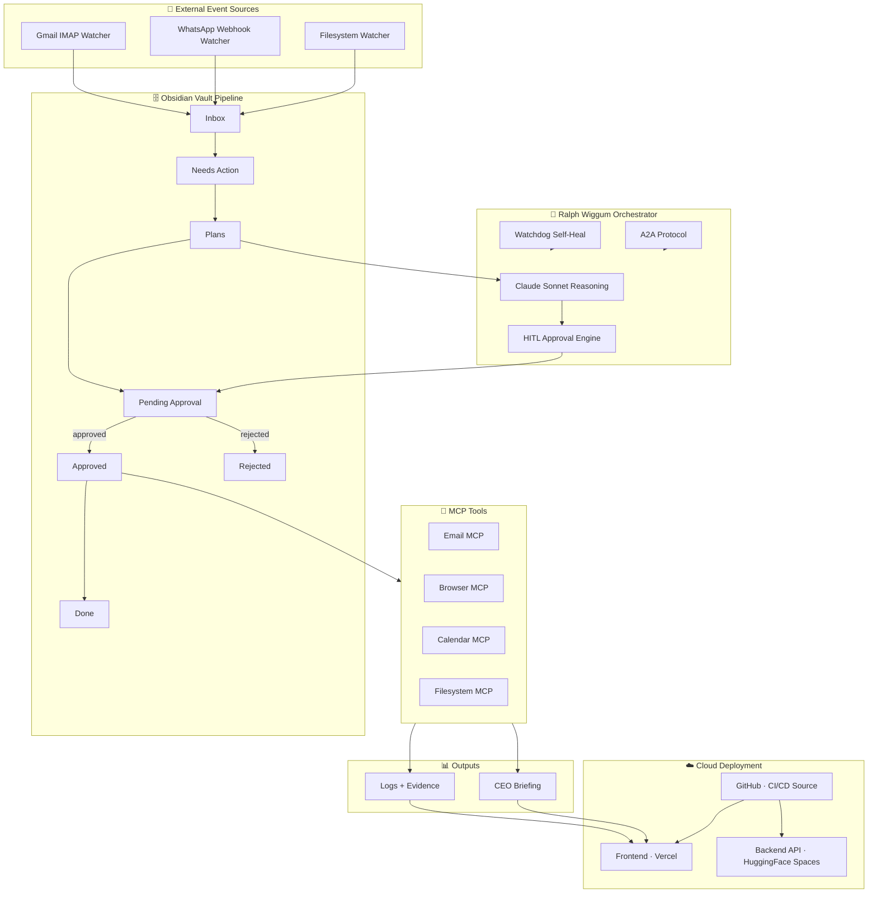

# 🏆 AI Employee Vault — IsmatFatima — Platinum Tier
### Personal AI Employee Hackathon 0

> **Project Owner:** Ismat Fatima &nbsp;|&nbsp; **Tier:** Platinum &nbsp;|&nbsp; **Model:** claude-sonnet-4-6


---

## 🚀 Live Deployment (Judge Quick Access)

| Service | URL |
|---------|-----|
| 🌐 Frontend Dashboard | https://ai-employee-vault-ismat-fatima-plat.vercel.app |
| 🤖 Backend API | https://ismat110-ai-employee-vault-ismat-platinum.hf.space |
| 📦 GitHub Repository | https://github.com/Fatima-Ismat/AI_Employee_Vault_IsmatFatima_Platinum_Hackathon0 |

---

## 🎬 System Workflow (End-to-End)

The AI Employee processes tasks through an autonomous multi-stage pipeline.

**Pipeline Flow:**

```
External Event → Watcher Detection → Vault Task Creation → Claude Reasoning →
Human Approval → MCP Tool Execution → Logs + CEO Briefing
```

---

## ⚡ Live Dashboard Demo

The AI Employee Dashboard allows real-time monitoring of the autonomous workflow.

> **Live:** [ai-employee-vault-ismat-fatima-plat.vercel.app](https://ai-employee-vault-ismat-fatima-plat.vercel.app)

**Features demonstrated:**

- Task creation and injection
- Human-in-the-Loop approval (Approve / Reject buttons)
- MCP tool execution tracking
- Evidence logging with full audit trail
- CEO briefing generation by Claude

---

## 📊 Evidence Sections (Live on Dashboard)

> **All evidence is viewable live on the dashboard — open the tabs below:**

### Judge Evidence Panel
→ Open the **[🏆 Judge Evidence tab](https://ai-employee-vault-ismat-fatima-plat.vercel.app)** on the live dashboard for the full interactive evidence pack including deployment proof, watcher proof, HITL proof, logs summary, CEO briefing proof, and Platinum checklist.

### HITL Approval Workflow
→ Open the **Approvals tab** on the live dashboard to see pending tasks, approve or reject them, and view the full `history/approvals.md` audit trail.

### System Logs and Task History
→ Open the **Logs tab** on the live dashboard to view real-time log entries from `AI_Employee_Vault/Logs/` with level filtering (ERROR · WARNING · INFO · DEBUG).

---

## 🧠 System Architecture



---

## 🏆 Platinum Tier Feature Matrix

| Capability | Status |
|------------|--------|
| Autonomous AI Employee | ✅ |
| Claude Sonnet 4.6 reasoning loop | ✅ |
| Human-in-the-Loop approvals | ✅ |
| Gmail watcher (IMAP + App Password) | ✅ |
| WhatsApp watcher (Webhook) | ✅ |
| Filesystem watcher (watchdog) | ✅ |
| MCP tool integrations (4 tools) | ✅ |
| Obsidian Vault 8-stage pipeline | ✅ |
| CEO briefing auto-generation | ✅ |
| Self-healing watchdog service | ✅ |
| Evidence logging system | ✅ |
| Full prompt + approval audit trail | ✅ |
| A2A agent communication protocol | ✅ |
| Cloud deployment (Vercel + HF Spaces) | ✅ |
| Next.js dashboard with Judge Evidence tab | ✅ |

---

## 🧪 30-Second Judge Test

To quickly evaluate the full system:

1. Open the **[Live Dashboard](https://ai-employee-vault-ismat-fatima-plat.vercel.app)**
2. Click **🏆 Judge Evidence** tab — see the full evidence pack
3. Switch to **Approvals** tab — approve or reject a pending task
4. Watch MCP tool execution reflected in the **Logs** tab
5. Open **CEO Briefing** tab — read the Claude-generated executive summary

> This demonstrates the complete autonomous AI employee pipeline end-to-end.

---

## ⭐ Key Features

- Autonomous AI Employee system powered by Claude Sonnet 4.6
- Claude Sonnet reasoning loop with full prompt history logging
- Human-in-the-loop approvals (HITL) with dashboard UI
- MCP tool integrations (Email · Browser · Calendar · Filesystem)
- Email / WhatsApp / Filesystem watchers
- Obsidian vault 8-stage workflow pipeline
- CEO briefing auto-generation by Claude
- Self-healing watchdog service with error recovery
- Full audit trail logging (prompts, agent runs, approvals)
- Judge evidence dashboard tab with interactive evidence pack

---

## 🧑‍⚖️ Judge Instructions

1. Open the **[Live Dashboard](https://ai-employee-vault-ismat-fatima-plat.vercel.app)**
2. Click the **🏆 Judge Evidence** tab
3. Trigger a demo task via the **Approvals** tab or run `python demo/advanced_demo.py`
4. Observe the full pipeline:

```
Claude Reasoning  →  Human Approval  →  MCP Execution  →  Evidence Logs  →  CEO Briefing
```

---

## ⚡ Judge Quick Evidence Summary

| Evidence Area | Proof |
|--------------|-------|
| **Cloud Deployment** | Vercel (frontend) + Hugging Face Spaces Docker (backend) + GitHub CI/CD |
| **Gmail Watcher** | `watchers/gmail_watcher.py` — IMAP + Gmail App Password (NOT OAuth) |
| **Filesystem Watcher** | `watchers/filesystem_watcher.py` — watchdog lib → `watched_folder/` |
| **WhatsApp Watcher** | `watchers/whatsapp_watcher.py` — Webhook → CRITICAL priority tasks |
| **HITL Approval** | `approval_system/hitl.py` + Dashboard Approvals tab + `history/approvals.md` |
| **Prompt History** | `history/prompts.md` — every Claude prompt+response logged |
| **CEO Briefing** | `analytics/ceo_briefing.py` → `AI_Employee_Vault/CEO_Briefing.md` |
| **MCP Tools** | Email · Browser · Calendar · Filesystem (4 tools in `mcp_servers/`) |
| **Obsidian Vault** | 8-stage pipeline: Inbox→Needs_Action→Plans→Pending_Approval→Approved/Rejected→Done |
| **Dashboard** | Next.js 14 · 6 tabs: Overview, Tasks, Approvals, Logs, CEO Briefing, **Judge Evidence** |
| **Backend API** | FastAPI · 10+ endpoints · `GET /system-status` · `POST /approvals/{id}/decide` |
| **A2A Protocol** | `agents/a2a_protocol.py` — agent-to-agent task delegation |
| **Self-Healing** | `watchdog_service/watchdog.py` + `resilience/error_recovery.py` |
| **Audit Trail** | `history/prompts.md` + `history/agent_runs.md` + `history/approvals.md` |

> **Judges: Open the live dashboard and click the "🏆 Judge Evidence" tab for the full interactive evidence pack.**

---

## Project Overview

A **production-grade autonomous AI employee system** powered by **Claude Sonnet 4.6**, featuring:

- **8-stage Obsidian vault pipeline** (file-based persistent memory)
- **3 event watchers** (Gmail IMAP, WhatsApp Webhook, Filesystem)
- **4 MCP tool servers** (Email, Browser, Calendar, Filesystem)
- **Human-in-the-Loop (HITL) approval workflow** with full audit trail
- **Ralph Wiggum autonomous orchestration loop**
- **CEO AI weekly briefings** generated by Claude
- **Self-healing watchdog** with error recovery
- **FastAPI REST backend** (10+ endpoints)
- **Next.js + Tailwind dashboard** (6 tabs, live data)
- **Cloud deployment**: Vercel (frontend) + Hugging Face Spaces (backend)

---

## Implementation Detail — Feature Files

### Core Requirements

| Feature | Implementation |
|---------|---------------|
| Claude as reasoning engine | `agents/claude_agent.py` — claude-sonnet-4-6 |
| Obsidian vault memory (8 stages) | `AI_Employee_Vault/` — full pipeline |
| Gmail watcher | `watchers/gmail_watcher.py` — IMAP + App Password |
| Filesystem watcher | `watchers/filesystem_watcher.py` — watchdog lib |
| WhatsApp watcher | `watchers/whatsapp_watcher.py` — Webhook |
| Email MCP | `mcp_servers/email_mcp.py` |
| Browser MCP | `mcp_servers/browser_mcp.py` |
| Calendar MCP | `mcp_servers/calendar_mcp.py` |
| Filesystem MCP | `mcp_servers/filesystem_mcp.py` |
| HITL approval workflow | `approval_system/hitl.py` |
| Ralph Wiggum autonomous loop | `orchestrator/agent_loop.py` |
| Prompt history logging | `history/prompts.md` (every call) |

### Platinum Bonus Features

| Feature | Implementation |
|---------|---------------|
| CEO AI Weekly Briefing | `analytics/ceo_briefing.py` |
| Pipeline visualization | `analytics/pipeline_visualizer.py` |
| Self-healing watchdog | `watchdog_service/watchdog.py` |
| Error recovery system | `resilience/error_recovery.py` |
| System health monitor | `monitoring/system_health.py` |
| FastAPI backend (10+ endpoints) | `backend/main.py` |
| Next.js + Tailwind dashboard | `frontend/` — 6 tabs including Judge Evidence |
| Cloud agent (S3/GCS/local) | `cloud/cloud_agent.py` |
| Vault sync manager | `cloud/sync_manager.py` |
| A2A agent communication | `agents/a2a_protocol.py` |
| Advanced demo (5 scenarios) | `demo/advanced_demo.py` |
| PM2 process management | `ecosystem.config.js` |
| Vercel cloud frontend deploy | `vercel.json` + GitHub CI/CD |
| Hugging Face backend deploy | `Dockerfile` + HF Spaces Docker |

---

## Gmail Watcher — Implementation Detail

Gmail Watcher uses **IMAP + Gmail App Password** (not OAuth client_secret.json):

```
Gmail Inbox (unread)
       │
       ▼
GmailWatcher.poll()   ← IMAP over SSL (imap.gmail.com:993)
       │
       ▼
Email parsed (subject, sender, body)
       │
       ▼
Priority inferred (urgent/invoice keywords → HIGH)
       │
       ▼
write_inbox_task() → AI_Employee_Vault/Inbox/task_xxxx.md
       │
       ▼
Orchestrator picks up on next cycle
```

**Setup:**
```env
GMAIL_USER=your@gmail.com
GMAIL_APP_PASSWORD=your-16-char-app-password
```
Enable IMAP in Gmail settings → Google Account → Security → App Passwords → create one.

---

## HITL Approval Flow

```
Agent flags sensitive action (e.g. send email, delete file)
         │
Pending_Approval/approval_xyz.md created  (status: pending)
         │
Human opens Dashboard → Approvals tab   (or Obsidian)
         │
Clicks Approve / Reject  →  POST /approvals/{id}/decide
         │
approval_system/hitl.py updates status in file
         │
Orchestrator detects change on next poll cycle
         │
If approved → MCP tool executes action → task moves to Done/
If rejected → task moves to Rejected/ with reason
         │
Decision permanently logged in history/approvals.md
```

---

## Repository Structure

```
AI_Employee_Vault_IsmatFatima_Platinum_Hackathon0/
├── AI_Employee_Vault/         Obsidian vault (memory + 8-stage pipeline)
│   ├── Dashboard.md
│   ├── CEO_Briefing.md        (auto-generated weekly by Claude)
│   ├── Inbox/  Needs_Action/  Plans/  Pending_Approval/
│   ├── Approved/  Rejected/  Done/  Recovery/
│   └── Logs/                  (daily pipeline logs)
├── history/                   Permanent audit trail (judge proof)
│   ├── prompts.md             every Claude prompt+response
│   ├── agent_runs.md          every orchestrator cycle
│   └── approvals.md           every HITL decision
├── watchers/                  Event detection (Gmail/WhatsApp/Filesystem)
├── agents/                    Claude reasoning + A2A protocol
├── orchestrator/              Ralph Wiggum autonomous loop
├── approval_system/           HITL workflow engine
├── mcp_servers/               Tool integrations (4 MCP servers)
├── analytics/                 CEO briefing + pipeline visualization
├── watchdog_service/          Self-healing monitor
├── monitoring/                System health checks
├── resilience/                Error recovery
├── cloud/                     Cloud deployment layer (S3/GCS/local)
├── backend/                   FastAPI REST API (10+ endpoints)
├── frontend/                  Next.js 14 + Tailwind dashboard
│   └── components/JudgeEvidence.tsx   Judge Evidence tab
├── demo/                      Demo scripts (zero API cost)
├── utils/                     Shared utilities
└── docs/                      Full documentation (10 files)
```

---

## Backend API Endpoints

| Method | Endpoint | Description |
|--------|----------|-------------|
| `GET` | `/` | Health check |
| `GET` | `/system-status` | Pipeline counts + vault health |
| `GET` | `/tasks` | All tasks (filterable by stage/source/priority) |
| `GET` | `/tasks/{task_id}` | Full task content |
| `GET` | `/logs` | Recent log entries |
| `GET` | `/approvals` | Approval history |
| `GET` | `/approvals/pending` | Pending approval queue |
| `POST` | `/approvals/{id}/decide` | Approve or reject a task |
| `GET` | `/ceo-briefing` | Latest CEO briefing markdown |
| `GET` | `/pipeline-stats` | Stage counts + completion rate |
| `GET` | `/analytics` | Source/priority breakdown + agent success rate |
| `POST` | `/tasks/inject` | Inject demo task into Inbox |
| `GET` | `/prompt-history` | Recent prompt/response pairs |

---

## Demo Mode (Zero API Cost)

Run the entire pipeline — all 5 scenarios, HITL approval, CEO briefing, pipeline visualization — **without any Anthropic API key**.

```bash
pip install -r requirements.txt
cp .env.example .env       # DEMO_MODE=true is default
python demo/advanced_demo.py
```

All Claude responses use realistic keyword-matched mock outputs, stamped `[Demo Mode / Simulated Claude Response]`. Every pipeline stage, vault folder, prompt log, HITL approval, and history file works identically.

For live Claude API:
```env
DEMO_MODE=false
ANTHROPIC_API_KEY=sk-ant-your-key-here
```

---

## Demo Scenarios

| # | Scenario | Key Features Demonstrated |
|---|----------|--------------------------|
| 1 | Email partnership request | Gmail watcher → Claude plan → HITL → email_mcp |
| 2 | File upload detection | Filesystem watcher → autonomous analysis |
| 3 | WhatsApp urgent message | CRITICAL priority → HITL escalation |
| 4 | CEO AI briefing | Claude executive report from task history |
| 5 | Pipeline visualization | ASCII diagram + Markdown stats report |

---

## Quick Start

```bash
# 1. Install
python -m venv .venv && source .venv/bin/activate
pip install -r requirements.txt

# 2. Configure
cp .env.example .env   # DEMO_MODE=true by default

# 3. Run demo (no API key needed)
python demo/advanced_demo.py

# 4. Start backend
uvicorn backend.main:app --reload --port 8000

# 5. Start frontend (separate terminal)
cd frontend && npm install && npm run dev
# Open: http://localhost:3000
```

Or with PM2:
```bash
pm2 start ecosystem.config.js && pm2 monit
```

---

## Cloud Deployment

| Layer | Platform | Config |
|-------|----------|--------|
| Frontend | **Vercel** | `vercel.json` · Root Directory: `frontend` · auto-deploy |
| Backend | **Hugging Face Spaces** | `Dockerfile` · Docker SDK · port 7860 |
| CI/CD | **GitHub** | Push to `main` → triggers Vercel + HF auto-deploy |
| Fallback | Oracle Cloud OCI | PM2 · `ecosystem.config.js` |

---

## Prompt History (Judge Proof)

```
history/prompts.md
──────────────────
timestamp: 2026-03-06 10:01:23 UTC
run_id: abc123
task_id: task_xyz

System Prompt:   [full system prompt]
User Prompt:     [task content + instruction]
Claude Response: {"summary": "...", "plan": [...], ...}
---
```

All prompts, agent runs, and approval decisions are permanently logged with timestamps.

---

## Future Roadmap

| Feature | Status |
|---------|--------|
| Slack watcher integration | Planned |
| Gmail OAuth full flow | In Progress |
| Multi-agent task delegation (A2A) | Implemented |
| Vector memory (embeddings) | Planned |
| Mobile dashboard (PWA) | Planned |
| Webhook ingest endpoint | Planned |
| Multi-tenant vault support | Planned |
| LLM-agnostic model switcher | Planned |

---

## Author

**Ismat Fatima**
Personal AI Employee Hackathon 0 — Platinum Tier
Model: claude-sonnet-4-6
GitHub: [Fatima-Ismat](https://github.com/Fatima-Ismat/AI_Employee_Vault_IsmatFatima_Platinum_Hackathon0)
Frontend: [ai-employee-vault-ismat-fatima-plat.vercel.app](https://ai-employee-vault-ismat-fatima-plat.vercel.app)
Backend: [ismat110-ai-employee-vault-ismat-platinum.hf.space](https://ismat110-ai-employee-vault-ismat-platinum.hf.space)
